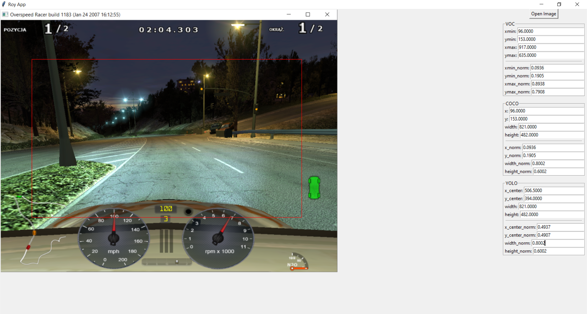

# Out of the Box

"I like to get into boxes."

A comprehensive toolkit for handling bounding boxes in various formats, including a GUI for ROI selection. For those who like to think out of the box.


## Features

- Bounding box utilities:
  - Support for VOC, COCO, and YOLO formats
  - Conversion between formats
  - Area calculation
  - Intersection over Union (IoU) calculation
  - Drawing bounding boxes on images

- Roy app:
  - Load any image file supported by PIL
  - Draw and adjust bounding box interactively
  - Display coordinates in both pixel and normalized formats
  - Real-time updates of bounding box parameters

## Installation

```
pip install out-of-the-box
```

## Usage

### Bounding box utilities

```python
img_shape = (500, 500)
img = np.zeros((*img_shape, 3), dtype=np.uint8)

# Create bounding boxes in different formats
voc_box = VOCBox(100, 100, 300, 300)
coco_box = COCOBox(100, 100, 200, 200)
yolo_box = YOLOBox(0.4, 0.4, 0.2, 0.2)

bb_voc = BoundingBox(voc_box, img_shape)
bb_coco = BoundingBox(coco_box, img_shape)
bb_yolo = BoundingBox(yolo_box, img_shape)

# Print bounding boxes
print("VOC bounding box:", bb_voc)
print("COCO bounding box:", bb_coco)
print("YOLO bounding box:", bb_yolo)

# Convert between formats
print("\nFormat conversions:")
print("VOC to COCO:", bb_voc.to_coco())
print("COCO to YOLO:", bb_coco.to_yolo())
print("YOLO to VOC:", bb_yolo.to_voc())

# Normalized and pixel coordinates
print("\nNormalized and pixel coordinates:")
print("VOC (normalized):", bb_voc.to_voc(normalized=True))
print("COCO (pixel):", bb_yolo.to_coco(normalized=False))

# Area calculation
print("\nAreas:")
print("VOC box area:", bb_voc.area)
print("COCO box area:", bb_coco.area)
print("YOLO box area:", bb_yolo.area)

# Intersection and Union
intersection = BoundingBox.intersection(bb_voc, bb_coco)
union = BoundingBox.union(bb_voc, bb_coco)
print("\nIntersection and Union:")
print(f"Intersection between VOC and COCO: {intersection:.2f}")
print(f"Union between VOC and COCO: {union:.2f}")

# IoU calculation
iou = BoundingBox.iou(bb_voc, bb_coco)
print(f"IoU between VOC and COCO boxes: {iou:.2f}")

# Percentage inside
percentage = bb_coco.percentage_inside(bb_voc)
print(f"\nPercentage of COCO box inside VOC box: {percentage:.2%}")

# Center point
print("\nCenter points:")
print("VOC box center:", bb_voc.center)
print("COCO box center:", bb_coco.center)
print("YOLO box center:", bb_yolo.center)

# Contains point
test_point = (200, 200)
print(f"\nPoint {test_point} contained in:")
print("VOC box:", bb_voc.contains_point(test_point))
print("COCO box:", bb_coco.contains_point(test_point))
print("YOLO box:", bb_yolo.contains_point(test_point))

# Overlap percentage
overlap = bb_coco.overlap_percentage(bb_voc)
print(f"\nOverlap percentage of COCO box with VOC box: {overlap:.2%}")

# Draw the bounding boxes on the image
img = bb_voc.draw_on_image(img, color=COLOR_RED, thickness=2, label="VOC")
img = bb_coco.draw_on_image(img, color=COLOR_GREEN, thickness=2, label="COCO")
img = bb_yolo.draw_on_image(img, color=COLOR_BLUE, thickness=2, label="YOLO")

# Display the image
cv2.imshow("Image with bounding boxes", img)
cv2.waitKey(0)
cv2.destroyAllWindows()
```

### Roy App



To start the ROI selector GUI:

```bash
roy
```

In the GUI:

1. Click "Open Image" to load an image.
2. Draw a bounding box by clicking and dragging on the image.
3. Adjust the box using the entry fields or by dragging.
4. View both pixel and normalized coordinates.

## License

This project is licensed under the MIT License. See the [LICENSE](LICENSE) file for details.
